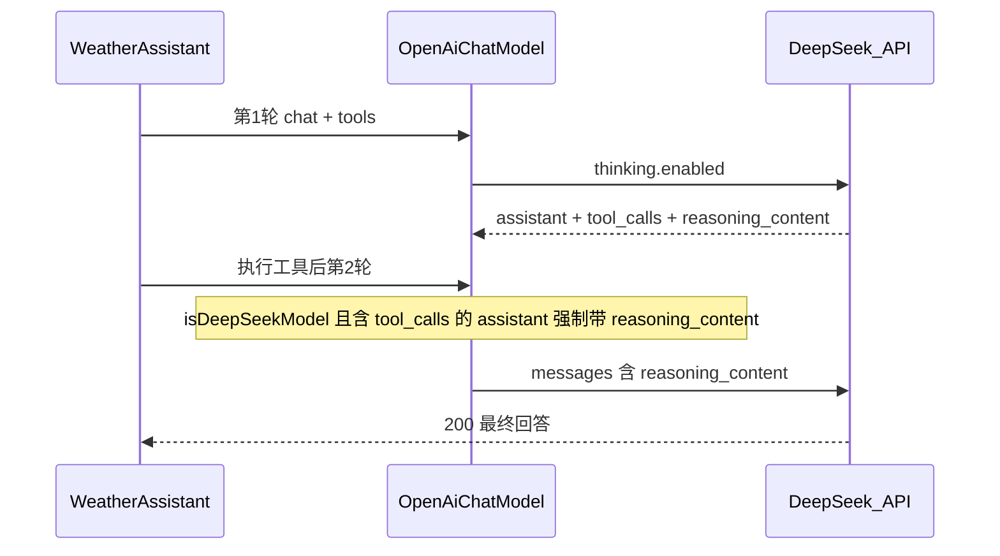

# deepseek-langchain

基于 Spring Boot + LangChain4j 的 DeepSeek V4 工具调用示例，演示如何在 **thinking 模式** 下完成多轮 `tool_calls`，并规避 DeepSeek API 的 400 错误。

## 问题现象

使用 `deepseek-v4-pro` 配合 LangChain4j `AiServices` 做多轮工具调用时，第二轮请求可能返回：

```text
400 Bad Request
{"error":{"message":"The `reasoning_content` in the thinking mode must be passed back to the API",...}}
```

## 原因说明

| 要点 | 说明 |
|------|------|
| thinking 默认开启 | `deepseek-v4-pro` 未传 `thinking` 时，API 按 **thinking 模式** 处理 |
| 工具轮次契约 | assistant 消息含 `tool_calls` 时，**后续每一轮** 必须把该轮的 `reasoning_content` 原样带回（可为 `""`） |
| LangChain4j 缺口 | 官方 `OpenAiUtils` 仅在 `sendThinking=true` 且 `AiMessage.thinking()` **非空** 时才写入 `reasoning_content`；空串或缺失仍会 400 |

错误请求示例（缺 `reasoning_content`）：

```json
{
  "role": "assistant",
  "content": "好的，我先来获取您当前的位置...",
  "tool_calls": [{ "id": "call_00_xxx", "type": "function", "function": { "name": "getCurrentLocation", "arguments": "{}" } }]
}
```

正确请求示例（需带回 `reasoning_content`）：

```json
{
  "role": "assistant",
  "tool_calls": [...],
  "reasoning_content": ""
}
```

官方文档：[Thinking Mode - Tool Calls](https://api-docs.deepseek.com/guides/thinking_mode)

## 本项目的解决办法

### 1. 补丁 `OpenAiChatModel`（推荐，保留 thinking）

在 [`src/main/java/dev/langchain4j/model/openai/OpenAiChatModel.java`](src/main/java/dev/langchain4j/model/openai/OpenAiChatModel.java) 中：

1. **按模型名分支**：仅当 `modelName` 包含 `deepseek` 时走自定义序列化，其它模型仍用 `OpenAiUtils` 原生逻辑。
2. **强制回传 `reasoning_content`**：对含 `tool_calls` 的 assistant 消息，序列化时始终写入 `reasoning_content`；`AiMessage.thinking()` 为 `null` 时使用 `""`。
3. **响应解析**：`return-thinking: true` 时从 API 响应解析 `reasoning_content` 到 `AiMessage.thinking()`，供下一轮原样回传。



### 2. 配置 `application.yml`

```yaml
langchain4j:
  open-ai:
    chat-model:
      api-key: ${DEEPSEEK_API_KEY}
      base-url: https://api.deepseek.com
      model-name: deepseek-v4-pro
      return-thinking: true          # 解析响应中的 reasoning_content
      reasoning-effort: high
      log-requests: true             # 可选，对照请求体
      custom-parameters:
        thinking:
          type: enabled            # 显式开启 thinking（也可依赖 V4 默认）
```

说明：`sendThinking` 未在 yml 中配置时，本补丁在构造函数里默认与 `returnThinking` 一致；DeepSeek 分支不依赖「thinking 非空」才写字段。

### 3. 备选方案：关闭 thinking（不改 Java）

若不需要推理链，可在 `custom-parameters` 中设置：

```yaml
custom-parameters:
  thinking:
    type: disabled
```

并关闭 `return-thinking`。此方式不要求回传 `reasoning_content`，但会失去 V4 thinking 能力。

## 快速开始

### 环境要求

- JDK 17+
- Maven 3.8+
- DeepSeek API Key

### 运行

```bash
# Windows PowerShell
$env:DEEPSEEK_API_KEY="your-api-key"

mvn spring-boot:run
```

或在 IDE 中运行 [`DeepseekLangchainApplication`](src/main/java/com/leikooo/deepseeklangchain/DeepseekLangchainApplication.java)，启动后会执行天气助手示例（`getCurrentLocation` → `getWeather`）。

### 验证修复

开启 `log-requests: true` 后，查看**第 2 次及以后**的 POST 请求体：`messages` 里带 `tool_calls` 的 `assistant` 应包含 `reasoning_content` 字段（有内容则为字符串，无则为 `""`），且不再出现上述 400。

## 项目结构

| 路径 | 说明 |
|------|------|
| `dev/langchain4j/model/openai/OpenAiChatModel.java` | 覆盖依赖中的同名类，实现 DeepSeek reasoning 回传 |
| `com/leikooo/deepseeklangchain/assistant/WeatherAssistant.java` | AiServices 天气助手 |
| `com/leikooo/deepseeklangchain/tool/*` | `@Tool` 工具定义 |
| `src/main/resources/application.yml` | API 与 thinking 配置 |

## 技术栈

- Spring Boot 3.5
- LangChain4j 1.15.0 + open-ai-spring-boot-starter
- DeepSeek Chat Completions API（OpenAI 兼容）

## 参考

- [DeepSeek Thinking Mode](https://api-docs.deepseek.com/guides/thinking_mode)
- [LangChain4j OpenAI 集成](https://github.com/langchain4j/langchain4j/blob/main/docs/docs/integrations/language-models/open-ai.md)
